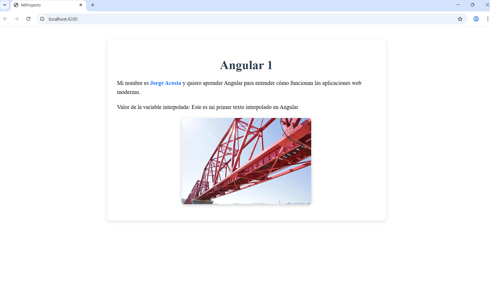

# Angular 1 – Mi primera app en Angular

##  Descripción del proyecto
Este proyecto corresponde a la actividad **"Mi primera app en Angular"**, cuyo objetivo es comprender el flujo básico de trabajo en Angular: creación del proyecto, exploración de la estructura, modificación del componente principal, interpolación y uso de la carpeta `assets`.

La aplicación desarrollada incluye:
- Un título dinámico.
- Un párrafo con el nombre del autor.
- Una variable interpolada utilizando signals.
- Una imagen cargada desde la carpeta `assets`.

---

##  Instalación y ejecución

### 1. Clonar el repositorio
```bash
git clone <URL-del-repositorio>
2. Instalar dependencias
bash
Copy code
npm install
3. Ejecutar la aplicación
bash
Copy code
ng serve -o
La aplicación se abrirá automáticamente en:

arduino
Copy code
http://localhost:4200
 Exploración de la estructura del proyecto
 
Este proyecto fue generado con Angular 17, que utiliza la arquitectura moderna basada en componentes standalone.

Por este motivo, Angular ya no genera los archivos tradicionales que aparecen en la consigna del material teórico:

app.component.ts

app.module.ts

environments/


A continuación se describen los archivos equivalentes, cumpliendo con la consigna adaptada a Angular 17.

✔ src/app/
Carpeta principal donde residen los elementos fundamentales de la aplicación.
Contiene el componente raíz y su configuración.

✔ app.ts
(Equivalente moderno a app.component.ts)
Define el componente raíz, incluyendo:

el título,

variables (signals),

la lógica básica del componente.

✔ app.html
(Equivalente moderno a app.component.html)
Es la plantilla HTML del componente raíz.
Aquí se muestran:

el título,

el párrafo personalizado,

la variable interpolada,

la imagen desde la carpeta assets.

✔ app.config.ts
(Equivalente moderno a app.module.ts)
Archivo que reemplaza al módulo principal antiguo.
Define:

configuraciones globales,

imports necesarios,

bootstrap inicial de la aplicación.

✔ assets/
Carpeta destinada a archivos estáticos como imágenes, íconos, documentos o recursos multimedia.
Todo lo que se coloca aquí se copia directamente al proyecto compilado.

✔ environments/
Este directorio ya no existe en Angular 17+.
Antes se utilizaba para manejar configuraciones separadas (desarrollo/producción).

En la arquitectura moderna, estas configuraciones se manejan mediante:

angular.json

configuraciones de build

opciones de entorno incluidas en la propia estructura del framework

 Capturas de pantalla



 Créditos del autor
Nombre: Jorge Acosta
Curso: Módulo 1 – Unidad 1 – Conociendo Angular

 Bibliografía y fuentes
Angular. (s.f.). Welcome to the Angular tutorial.
https://angular.dev/tutorials/learn-angular

Angular. (s.f.). The Angular CLI.
https://angular.dev/tools/cli

Angular. (s.f.). Anatomy of a component.
https://angular.dev/guide/components

Freeman, A. (2020). Pro Angular 9. Apress.

Imágenes
Imagen local (puente.jpg / puente.png).
Fuente: https://pixabay.com/es/